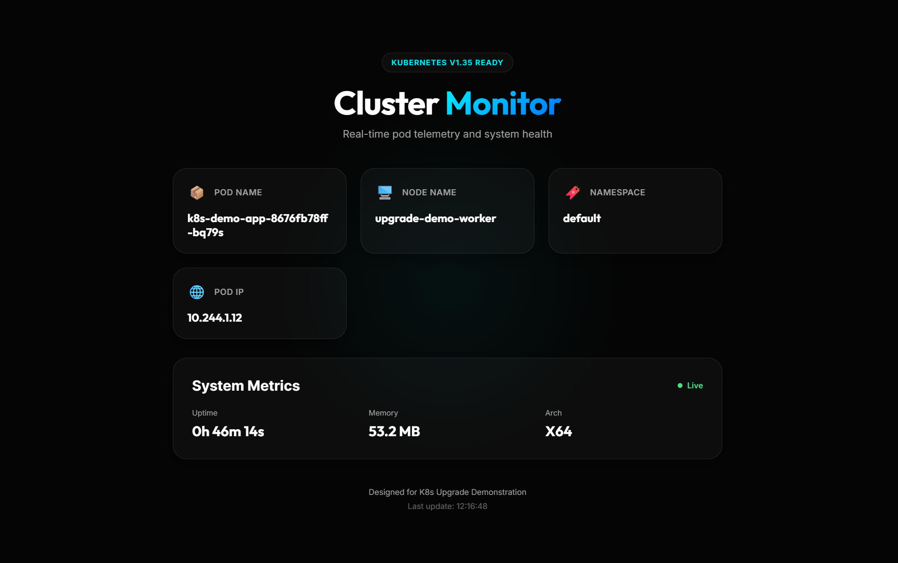

# Kubernetes Cluster Upgrade: v1.34 to v1.35

This repository contains a sample Node.js application and the necessary infrastructure configurations to perform a Kubernetes cluster upgrade from version `1.34` to `1.35`. The setup uses a multi-node Kind cluster running on an AWS EC2 Ubuntu instance.

The included "Cluster Monitor" application provides real-time telemetry of pod distribution across nodes, allowing for the observation of pod rescheduling during maintenance operations.



## Project Structure

- **Application**: A Node.js Express server with a real-time telemetry dashboard.
- **Containerization**: A multi-stage Dockerfile for an optimized runtime environment.
- **Orchestration**: Kubernetes manifests defining a NodePort service and a Deployment with three replicas.
- **Infrastructure**: Kind configuration for a 3-node cluster and an automated setup script for Ubuntu.

## Environment Preparation (Run on AWS EC2 Host)

Prepare the host environment by installing the necessary tools:

1. Clone the repository:
   ```bash
   git clone https://github.com/pooja-bhavani/k8s-v1.35.git
   ```

2. Change directory to the repository:
   ```bash
   cd k8s-v1.35
   ```

3. Execute the setup script:

   **This setup script installs all necessary tools**
   **Run setup (installs Docker, kubectl, kind, etc.)** 

   ```bash
   chmod +x setup-k8s.sh
   ./setup-k8s.sh
   ```

5. Refresh group membership for Docker:
   ```bash
   newgrp docker
   ```

6. Initialize the v1.34 cluster:
   **The cluster is running v1.34.0 on one control plane and two workers.**
   
   ```bash
   kind create cluster --config kind-config.yaml --name upgrade-demo
   ```

## Application Deployment (Run on AWS EC2 Host)

1. Build the container image:
   ```bash
   docker build -t <YOUR-DOCKERHUB-USERNAME>/k8s-demo-app:v1.0.0 .
   ```

2. Push the image to DockerHub:
   ```bash
   docker push <YOUR-DOCKERHUB-USERNAME>/k8s-demo-app:v1.0.0
   ```

3. Update the image in the k8s/manifests.yaml file

4. Deploy the application:
   ```bash
   kubectl apply -f k8s/manifests.yaml
   ```

5. Access the dashboard:
   Navigate to `http://<EC2-Public-IP>` in your browser. Ensure Port 80 is open in your AWS Security Group.

---

## Official Kubernetes Dashboard Setup (Optional)

Configure the official Kubernetes Dashboard to provide a standard administrative interface for the cluster.

1. Install the Dashboard:
   ```bash
   kubectl apply -f https://raw.githubusercontent.com/kubernetes/dashboard/v2.7.0/aio/deploy/recommended.yaml
   ```

2. Create a Service Account for Access:
   ```bash
   # Create service account
   kubectl create serviceaccount admin-user -n kubernetes-dashboard

   # Assign ClusterRoleBinding
   kubectl create clusterrolebinding admin-user --clusterrole=cluster-admin --serviceaccount=kubernetes-dashboard:admin-user
   ```

3. Generate Access Token:
   ```bash
   kubectl -n kubernetes-dashboard create token admin-user
   ```

4. Access the Dashboard:
   Use port forwarding in a separate session to access the interface securely:
   ```bash
   kubectl port-forward -n kubernetes-dashboard service/kubernetes-dashboard 8080:443 --address 0.0.0.0 &
   ```

   Access via `https://<EC2-Public-IP>:8080`.

5. Use the dashboard to monitor the cluster.
   - Nodes Creation and version before and after upgrade
   - Pods Creation and version before and after upgrade
   - etc.

---

## The Upgrade Process (v1.34.0 to v1.35.0)

Since Kind operates within Docker containers, all upgrade commands must be executed within the specific node containers to simulate a standard infrastructure upgrade.

### Phase 1: Control Plane Upgrade

**Step 1: Drain the node (Run on EC2 Host)**
```bash
kubectl drain upgrade-demo-control-plane --ignore-daemonsets --delete-emptydir-data
```

**Step 2: Enter the node container (Run on EC2 Host)**
```bash
docker exec -it upgrade-demo-control-plane bash
```

**Step 3: Upgrade components (Run INSIDE Control Plane Container)**
```bash
# Configure v1.35 repository
apt update && apt install -y curl gnupg
mkdir -p /etc/apt/keyrings
curl -fsSL https://pkgs.k8s.io/core:/stable:/v1.35/deb/Release.key | gpg --dearmor --yes -o /etc/apt/keyrings/kubernetes-apt-keyring.gpg
echo 'deb [signed-by=/etc/apt/keyrings/kubernetes-apt-keyring.gpg] https://pkgs.k8s.io/core:/stable:/v1.35/deb/ /' | tee /etc/apt/sources.list.d/kubernetes.list
apt update

# Upgrade kubeadm
apt-mark unhold kubeadm
apt install -y kubeadm=1.35.0-1.1
apt-mark hold kubeadm

# Run the upgrade
kubeadm upgrade plan --ignore-preflight-errors=SystemVerification
kubeadm upgrade apply v1.35.0 --ignore-preflight-errors=SystemVerification

# Upgrade kubelet and kubectl
apt-mark unhold kubelet kubectl
apt install -y kubelet=1.35.0-1.1 kubectl=1.35.0-1.1
apt-mark hold kubelet kubectl
systemctl restart kubelet

# Exit the container
exit
```

**Step 4: Uncordon the node (Run on EC2 Host)**
```bash
kubectl uncordon upgrade-demo-control-plane
```


---

> [!NOTE]
> 
> Forward the port to access the dashboard again
> ```bash
> kubectl port-forward -n kubernetes-dashboard service/kubernetes-dashboard 8080:443 --address 0.0.0.0 &
> ```
> 
> And see the Control Plane node version is updated to v1.35.0
>
> Forward it whenever you want to access the dashboard & your dashboard will be available at `http://<EC2-Public-IP>:8080`

---

### Phase 2: Worker Node 01 Upgrade

**Step 1: Drain the node (Run on EC2 Host)**
```bash
kubectl drain upgrade-demo-worker --ignore-daemonsets --delete-emptydir-data
```

**Step 2: Enter the node container (Run on EC2 Host)**
```bash
docker exec -it upgrade-demo-worker bash
```

**Step 3: Upgrade components (Run INSIDE Worker Container)**
```bash
# Configure v1.35 repository
apt update && apt install -y curl gnupg
mkdir -p /etc/apt/keyrings
curl -fsSL https://pkgs.k8s.io/core:/stable:/v1.35/deb/Release.key | gpg --dearmor --yes -o /etc/apt/keyrings/kubernetes-apt-keyring.gpg
echo 'deb [signed-by=/etc/apt/keyrings/kubernetes-apt-keyring.gpg] https://pkgs.k8s.io/core:/stable:/v1.35/deb/ /' | tee /etc/apt/sources.list.d/kubernetes.list
apt update

# Upgrade tools and configuration
apt-mark unhold kubeadm kubelet kubectl
apt install -y kubeadm=1.35.0-1.1 kubelet=1.35.0-1.1 kubectl=1.35.0-1.1
kubeadm upgrade node --ignore-preflight-errors=SystemVerification
apt-mark hold kubeadm kubelet kubectl
systemctl restart kubelet

# Exit the container
exit
```

**Step 4: Uncordon the node (Run on EC2 Host)**
```bash
kubectl uncordon upgrade-demo-worker
```

---

### Phase 3: Worker Node 02 Upgrade

**Step 1: Drain the node (Run on EC2 Host)**
```bash
kubectl drain upgrade-demo-worker2 --ignore-daemonsets --delete-emptydir-data
```

**Step 2: Enter the node container (Run on EC2 Host)**
```bash
docker exec -it upgrade-demo-worker2 bash
```

**Step 3: Upgrade components (Run INSIDE Worker Container)**
```bash
# Configure v1.35 repository
apt update && apt install -y curl gnupg
mkdir -p /etc/apt/keyrings
curl -fsSL https://pkgs.k8s.io/core:/stable:/v1.35/deb/Release.key | gpg --dearmor --yes -o /etc/apt/keyrings/kubernetes-apt-keyring.gpg
echo 'deb [signed-by=/etc/apt/keyrings/kubernetes-apt-keyring.gpg] https://pkgs.k8s.io/core:/stable:/v1.35/deb/ /' | tee /etc/apt/sources.list.d/kubernetes.list
apt update

# Upgrade tools and configuration
apt-mark unhold kubeadm kubelet kubectl
apt install -y kubeadm=1.35.0-1.1 kubelet=1.35.0-1.1 kubectl=1.35.0-1.1
kubeadm upgrade node --ignore-preflight-errors=SystemVerification
apt-mark hold kubeadm kubelet kubectl
systemctl restart kubelet

# Exit the container
exit
```

**Step 4: Uncordon the node (Run on EC2 Host)**
```bash
kubectl uncordon upgrade-demo-worker2
```

---

## Post-Upgrade Verification

Confirm the successful completion of the upgrade and monitor the environment state.

### Command Line Verification
On your EC2 Host, check the cluster status:
```bash
kubectl get nodes -o wide
```

**Expected Output**: All nodes should report `STATUS: Ready` and `VERSION: v1.35.0`.


### Monitoring the Upgrade
1. Monitor the **Cluster Monitor** dashboard(running on port 80) & Kubernetes Dashboard(running on port 8080) during maintenance, see the dashboard at https://<EC2-Public-IP>:8080.
2. Observe pod eviction and recreation on available nodes during worker upgrades, see the versions of nodes and pods in the dashboard.
3. Verify that the application running on port 80 maintains availability throughout the rolling process.

---

## Before upgrade

- System Information:

   ```bash
   kubectl get nodes -o wide
   ```

   

   - upgrade-demo-control-plane

      

   - upgrade-demo-worker

      

   - upgrade-demo-worker2

         

---

## After upgrade

- System Information:

   ```bash
   kubectl get nodes -o wide
   ```

   

   - upgrade-demo-control-plane

      

   - upgrade-demo-worker

      

   - upgrade-demo-worker2

         

---

## Local Testing
To run the application locally without Kubernetes:
```bash
npm install
npm start
```
The dashboard will be available at http://localhost:3000.
